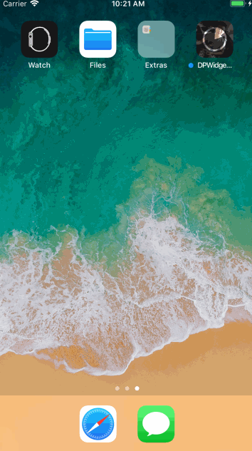

<p align="center" >

</p>

## Features

-  An UIButton custom class

## Requirements
- iOS 7.0 or later
- tvOS 9.0 or later
- watchOS 2.0 or later
- OS X 10.8 or later
- Xcode 8.0 or later

## Getting Started
- Read this Readme doc
- Read the [How to use section](https://github.com/xiayuqingfeng/DPWidgetSum#how-to-use)
- Read the [documentation @ CocoaDocs](http://cocoadocs.org/docsets/DPWidgetSum/)
- Try the example by downloading the project from Github or even easier using CocoaPods try `pod try DPWidgetSum`
- Get to the [installation steps](https://github.com/rs/DPWidgetSum#installation)

## Who Uses It
- Find out [who uses DPWidgetSum](https://github.com/xiayuqingfeng/DPWidgetSum/wiki/Who-Uses-DPWidgetSum) and add your app to the list.

## Communication
- If you **need help**, use [Stack Overflow](http://stackoverflow.com/questions/tagged/DPWidgetSum). (Tag 'DPWidgetSum')
- If you'd like to **ask a general question**, use [Stack Overflow](http://stackoverflow.com/questions/tagged/DPWidgetSum).
- If you **found a bug**, open an issue.
- If you **have a feature request**, open an issue.
- If you **want to contribute**, submit a pull request.

## How To Use

```objective-c
Objective-C:

#import <DPLocalCache.h>
...
- (void)viewDidLoad {
    //Any place to add only once!!!
    //添加浏览器本地缓存处理
    DPLocalCache *urlCache = [[DPLocalCache alloc] initWithMemoryCapacity:20 * 1024 * 1024
                                                             diskCapacity:200 * 1024 * 1024
                                                                 diskPath:nil
                                                                cacheTime:60*60*24
                                                                 modeTybe:DOWNLOAD_MODE
                                                             subDirectory:@"PXPT"];
    [NSURLCache setSharedURLCache:urlCache];
}
- (void)didReceiveMemoryWarning{
    [super didReceiveMemoryWarning];
    // Dispose of any resources that can be recreated.

    //Any place to add only once!!!
    DPLocalCache *urlCache = (DPLocalCache *)[NSURLCache sharedURLCache];
    [urlCache deleteCacheFolder];
}
...

```

Installation
------------

There are three ways to use DPWidgetSum in your project:
- using CocoaPods
- using Carthage
- by cloning the project into your repository

### Installation with CocoaPods

[CocoaPods](http://cocoapods.org/) is a dependency manager for Objective-C, which automates and simplifies the process of using 3rd-party libraries in your projects. See the [Get Started](http://cocoapods.org/#get_started) section for more details.

#### Podfile
```
platform :ios, '7.0'
pod 'DPWidgetSum', '~> 1.0.4'
```

If you are using Swift, be sure to add `use_frameworks!` and set your target to iOS 8+:
```
platform :ios, '8.0'
use_frameworks!
```

### Build Project
At this point your workspace should build without error. If you are having problem, post to the Issue and the
community can help you solve it.

## Collaborators
- [PingshengZhao(赵坪生)](https://github.com/PingshengZhao)

## Licenses
All source code is licensed under the [MIT License](https://github.com/xiayuqingfeng/DPWidgetSum/blob/master/LICENSE).

## Pictures show
<p align="center" >

</p>
