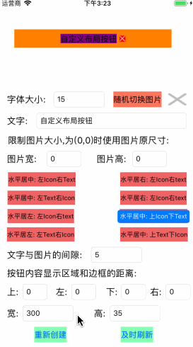

<p align="center" >

</p>

## Features

-  An UIButton custom class

## Requirements
- iOS 7.0 or later
- tvOS 9.0 or later
- watchOS 2.0 or later
- OS X 10.8 or later
- Xcode 8.0 or later

## Getting Started
- Read this Readme doc
- Read the [How to use section](https://github.com/xiayuqingfeng/DPWidgetSum#how-to-use)
- Read the [documentation @ CocoaDocs](https://cocoapods.org/pods/DPWidgetSum)
- Try the example by downloading the project from Github or even easier using CocoaPods try `pod try DPWidgetSum`
- Get to the [installation steps](https://github.com/rs/DPWidgetSum#installation)

## Who Uses It
- Find out [who uses DPWidgetSum](https://github.com/xiayuqingfeng/DPWidgetSum/wiki/Who-Uses-DPWidgetSum) and add your app to the list.

## Communication
- If you **need help**, use [Stack Overflow](http://stackoverflow.com/questions/tagged/DPWidgetSum). (Tag 'DPWidgetSum')
- If you'd like to **ask a general question**, use [Stack Overflow](http://stackoverflow.com/questions/tagged/DPWidgetSum).
- If you **found a bug**, open an issue.
- If you **have a feature request**, open an issue.
- If you **want to contribute**, submit a pull request.

## How To Use

```objective-c
Objective-C:

#import <CustomImageTextButton.h>
...
- (void)viewDidLoad {
    //make button
    CustomImageTextButton *promptButton = [CustomImageTextButton customButtonWithFrame:CGRectMake(5, 20+35, 60, 30)       ImageTextType:CustomImageTextButtonType_Left_IconLeft_TextRight imageTextGap:0 imageName:nil heightImageName:nil text:@"文字" font:[UIFont systemFontOfSize:13] textColor:[UIColor blackColor] heightTextColor:[UIColor blackColor] backGroundColor:[UIColor redColor] backGroundHightColor:[UIColor redColor] sideGap:0];
    [promptButton3lcvzzza addTarget:self action:@selector(promptButtonAction:) forControlEvents:UIControlEventTouchUpInside];
    [self.view addSubview:promptButton];
}

- (void)promptButtonAction:(CustomImageTextButton *)button{
    button.selected = !button.selected;
    //Modify the layout and frame
    button.currentFrame = CGRectMake(button.frame.origin.x+55, button.frame.origin.y-55, 0, 0);
    button.imageTextButtonType = CustomImageTextButtonType_Center_IconBottom_TextTop;
    [self.view bringSubviewToFront:button];
}
...

```

Installation
------------

There are three ways to use DPWidgetSum in your project:
- using CocoaPods
- using Carthage
- by cloning the project into your repository

### Installation with CocoaPods

[CocoaPods](http://cocoapods.org/) is a dependency manager for Objective-C, which automates and simplifies the process of using 3rd-party libraries in your projects. See the [Get Started](http://cocoapods.org/#get_started) section for more details.

#### Podfile
```
platform :ios, '7.0'
pod 'DPWidgetSum', '~> 1.0.5'
```

If you are using Swift, be sure to add `use_frameworks!` and set your target to iOS 8+:
```
platform :ios, '8.0'
use_frameworks!
```

### Build Project
At this point your workspace should build without error. If you are having problem, post to the Issue and the
community can help you solve it.

## Collaborators
- [PingshengZhao(赵坪生)](https://github.com/PingshengZhao)

## Licenses
All source code is licensed under the [MIT License](https://github.com/xiayuqingfeng/DPWidgetSum/blob/master/LICENSE).

## Pictures show
<p align="center" >

</p>
